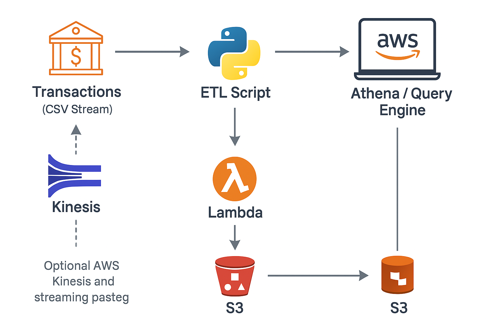

# Finance Real-Time Streaming Analytics

## 📌 Project Overview
This project simulates a **real-time financial transaction monitoring pipeline**.  
It demonstrates how **AWS services and DevOps practices** can be used to:
- Stream and process **credit/debit transactions**
- Aggregate transaction totals
- Detect **potential frauds or anomalies**
- Provide **analytics-ready data** for reporting

---

## 🏗️ Architecture Overview
The solution follows a **streaming ETL pipeline**:

1. **Transaction Stream** → Simulated transaction CSV data
2. **ETL Script (Python)** → Processes streaming data & flags anomalies
3. **S3 (Data Lake)** → Stores raw & processed transactions
4. **Athena / Analytics Layer** → Query transactions for insights
5. **Optional: Kinesis + Lambda** → Can be added for real-time streaming



---

## 📂 Project Structure
```
finance-real-time-analytics/
├── terraform/                 # Infrastructure as Code (AWS resources)
│   ├── main.tf
│   ├── variables.tf
│   └── outputs.tf
│
├── etl/                       # Python scripts for ETL/streaming
│   └── streaming_etl.py
│
├── sample_data/                # Sample data for streaming simulation
│   ├── transactions_stream.csv
│   └── processed_transactions.csv
│
├── architecture_diagram.png    # Architecture visualization
├── etl_output.png              # Processed ETL sample output screenshot
├── athena_query_result.png     # Sample query result screenshot
└── README.md
```

---

## ⚙️ Steps to Reproduce

1. **Clone the Repository**
   ```bash
   git clone https://github.com/<your-username>/finance-real-time-analytics.git
   cd finance-real-time-analytics
   ```

2. **Run ETL Script**
   ```bash
   cd etl
   python streaming_etl.py
   ```
   - Generates processed CSV in `sample_data/processed_transactions.csv`

3. **(Optional) Deploy Terraform**
   ```bash
   cd terraform
   terraform init
   terraform apply
   ```
   - Creates S3 bucket and basic AWS infra for simulation

4. **Query Processed Data**
   - Use **Athena or Excel** to summarize transactions
   - Sample result:

   | transaction_type | total_amount |
   |-----------------|--------------|
   | credit          | 15000        |
   | debit           | 8200         |

---

## 📊 Screenshots

- **ETL Script Output:**  
  

- **Athena Query Result:**  
  

---

## ✅ Skills Demonstrated
- **AWS:** S3, Athena, (optional Kinesis & Lambda)
- **DevOps:** Terraform IaC, GitHub, project structuring
- **Data Engineering:** ETL pipelines, fraud detection logic
